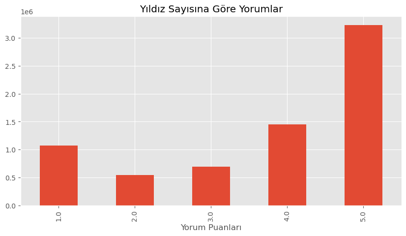
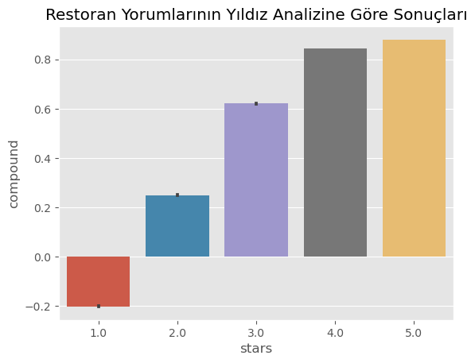
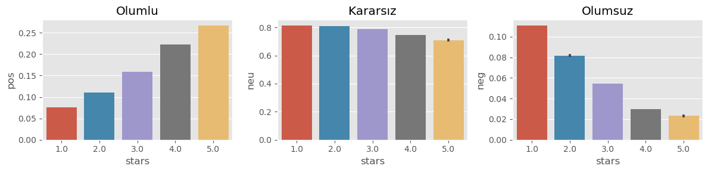
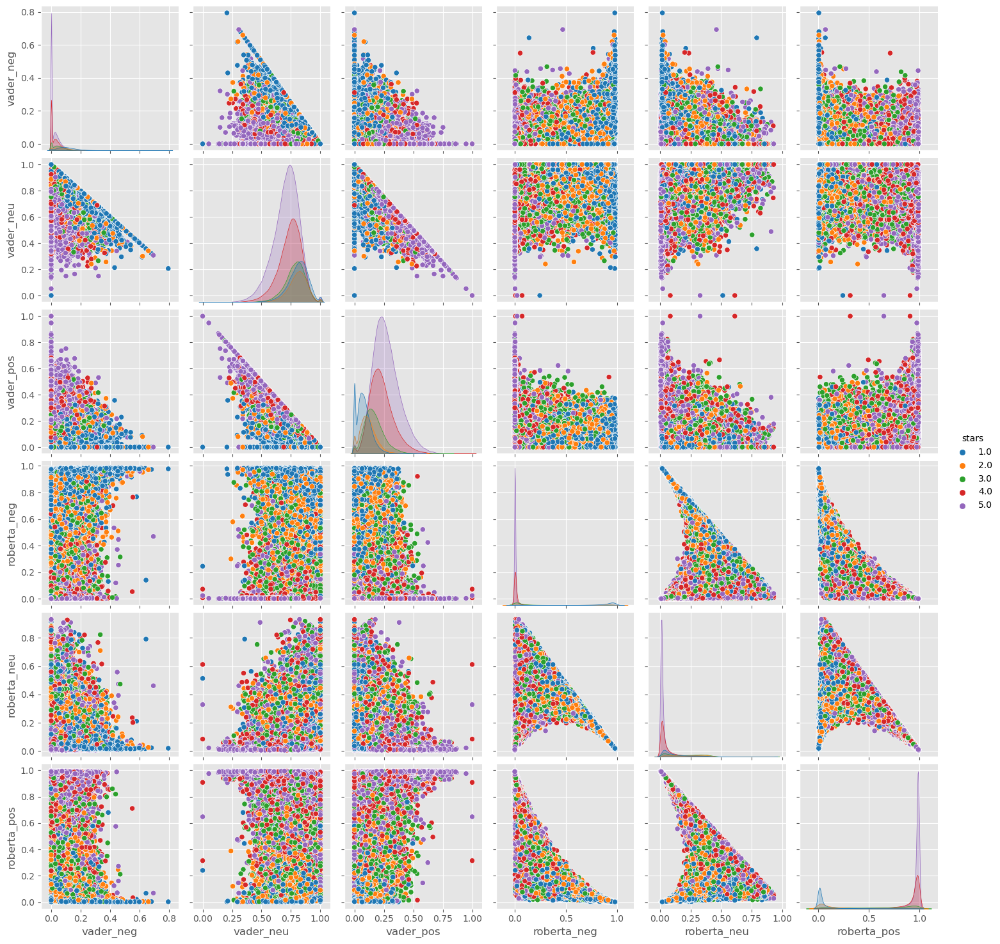

# Yelp Firma Yorumları Analizi
Bu proje, **Yelp academic veriseti** kullanılarak (veriseti korumalı olduğundan paylaşamadım), firma yorumlarının **pozitif**, **nötr** veya **negatif** olarak sınıflandırılmasını ve bu analizlerin anlamlı sonuçlara dönüştürülmesini amaçlamaktadır. Çalışma, NLP (Doğal Dil İşleme) modelleri ve LLM (Large Language Model) entegrasyonlarını içermektedir.

## Proje Hedefleri
- Kullanıcı yorumlarını analiz ederek pozitif, nötr ve negatif kategorilere sınıflandırmak.
- Firmaların müşteri memnuniyet oranlarını belirlemek.
- LLM (Büyük Dil Modelleri) kullanarak, analiz sonuçlarından anlamlı raporlar ve öneriler oluşturmak.
- Firma performansı ve müşteri memnuniyeti hakkında genel bir değerlendirme sağlamak.

---

## Kullanılan Teknolojiler ve Araçlar
### Programlama Dili
- Python 3.10+

### Kütüphaneler
- **NLP ve LLM Modelleri**:
  - Transformers (Hugging Face) – GPT-2, Flan-T5, BART
  - nltk – Metin ön işleme
- **Veri İşleme**:
  - pandas
  - numpy
- **Görselleştirme**:
  - matplotlib
  - seaborn
- **API Geliştirme**:
  - FastAPI (isteğe bağlı)

---

## Kurulum
### Teknoloji ve Ortam Kurulumu
Proje Python programlama dili kullanılarak kodlanmıştır. Bu proje için gerekli kütüphaneler 'env' klasöründe listelenmiştir:
- **Anaconda** kullanıyorsanız gerekli ortamı oluşturmak için `environment.yml` dosyası kullanılabilir.
- Anaconda kullanıcısı olmayanlar için, ilgili kütüphane sürümleri için `environment_fh.yml` dosyası kullanılabilir.

#### LLM Modeli için (Örnek):

- **Tokenizer yükleme**
```python
from transformers import AutoTokenizer, AutoModelForSeq2SeqLM
```
- **Flan-T5 modelini yükleme**
```python
model_name = "google/flan-t5-small"
tokenizer = AutoTokenizer.from_pretrained(model_name)
model = AutoModelForSeq2SeqLM.from_pretrained(model_name)
```

### Veri Kümeleri
Bu projede kullanılan veri setleri `datasets/custom` klasöründe bulunur. Bunlar şunları içerir:
- **Data**
- **Data with Classification**

## Görev Belgesi
Görev ayrıntıları ve gereksinimleri, proje dizininde bulunan bir `.docx` dosyasında belgelenmiştir.

## Görev 1: Veri Temizleme, İşleme ve Sınıflandırma

### **İnceleme Verilerinin İşlenmesi ve İlk Araştırma**

1. **İnceleme Verilerinin Yüklenmesi**:
- Bu işlem `duygu analizi.ipynb` içinde gerçeklenir.
- Yelp veri kümesindeki (`yelp_academic_dataset_review.json`) inceleme verileri `json` ve `pandas` kullanılarak yüklenir.
- Veriler `json_file.readlines()` kullanılarak satır satır okunur ve ardından `json.loads()` kullanılarak ayrıştırılır. Bu adım, verilerin boyutu nedeniyle yaklaşık 4-5 dakika süren 7 milyon satırın tamamını işler.

2. **Bir Veri Çerçevesine Dönüştürme**:
- JSON verileri okunup ayrıştırıldıktan sonra, daha fazla analiz yapmayı kolaylaştıran bir `pandas` Veri Çerçevesine (`review_df`) dönüştürülür.

3. **Hızlı Keşifsel Veri Analizi (EDA)**:
- `stars` sütununun dağılımı (her incelemenin derecesini temsil eder) her derecelendirmenin sıklığını gösteren `value_counts()` kullanılarak analiz edilir.
- İnceleme derecelendirmelerinin dağılımını görselleştirmek için bir çubuk grafik çizilir:

- Derecelendirmeler X ekseninde gösterilir.
- Her derecelendirmenin sıklığı Y ekseninde gösterilir.

---

### **İncelemelerin Duygu Sınıflandırma Puanlaması**

İncelemelerin duygusunu sınıflandırmak için iki yaklaşım kullanılır:

#### Adım 1- VADER Duygu Puanlaması

VADER (Valence Aware Dictionary ve Sentiment Reasoner), "bag of words" yaklaşımını kullanan bir sözlük ve kural tabanlı duygu analizi aracıdır. Metni işler ve duygu puanlarını şu şekilde hesaplar:
- Durdurma sözcüklerini kaldırma.
- Her bir kelimeyi puanlama ve toplam puanı oluşturmak için birleştirme.

Aşağıdaki kod, VADER kullanarak duygu analizi gerçekleştirir:

1. **Gerekli Kitaplıkları İçe Aktarma**:
- Duygu puanlarını hesaplamak için `nltk`'den `SentimentIntensityAnalyzer` kullanılır.
- İlerlemeyi izlemek için `tqdm.notebook` kullanılır.

2. **İncelemeleri İşleme**:
- Duygu analizi, veri kümesindeki her incelemeye uygulanır. `polarity_scores()` yöntemi, pozitif, negatif ve nötr duyguyu ve bileşik puanı hesaplar.

3. **Bir Veri Çerçevesi Oluşturma**:
- Sonuçlar bir sözlükte (`res`) saklanır ve daha sonra bir Veri Çerçevesine (`vaders`) dönüştürülür. Bu Veri Çerçevesi, daha ileri analiz için orijinal `review_df` ile birleştirilir.

4. **Görselleştirme**:
- Duygu analizi sonuçları çubuk grafiklerde görselleştirilir:
- `bileşik` puanının inceleme derecelendirmelerine (`stars`) karşı bir çubuk grafiği. 

- Pozitif (`pos`), nötr (`neu`) ve negatif (`neg`) duygu puanları için ayrı çubuk grafikleri.


#### Adım 2- Roberta Önceden Eğitilmiş Modeli

İkinci yaklaşım, büyük bir veri gövdesine dayanan ve yalnızca tek tek kelimeleri değil aynı zamanda cümle içindeki bağlamı da dikkate alan önceden eğitilmiş bir Roberta modeli kullanır.

##### **Önceden Eğitilmiş Modeli Yükleme:**

- `cardiffnlp/twitter-roberta-base-sentiment` modeli `transformers` kütüphanesinden yüklenir.
- `AutoTokenizer` ve `AutoModelForSequenceClassification` sınıfları sırasıyla belirteçleyiciyi ve modeli yüklemek için kullanılır.

##### **Duygu Puanlaması:**

- `polarity_scores_roberta()` işlevi inceleme metnini kodlar ve Roberta modelini kullanarak duygu puanlarını hesaplar. Softmax işlevi puanları normalleştirmek için uygulanır.

##### **Hataları ve Büyük Metinleri Ele Alma:**

- 1500 karakterden fazla olan incelemeler atlanır ve sorunlu incelemeler için hatalar kaydedilir.

##### **Sonuçlar:**

- Sonuçlar, her inceleme için hem VADER hem de Roberta duygu puanlarıyla bir sözlükte (`res`) saklanır. Daha sonra bu sonuçlar tek bir Veri Çerçevesinde (`results_df`) birleştirilir.

#### **Görselleştirme:**

- VADER ve Roberta duygu puanları arasındaki ilişkiyi görselleştirmek için bir çift grafik oluşturulur ve incelemenin yıldız derecesine göre renklendirilir.


#### Son Adım- Sonuçları Bir Veritabanına Kaydetme

##### **Veritabanı Kurulumu:**

- Duygu analizi sonuçlarını bir SQLite veritabanına (`business_recommendations.db`) kaydetmek için `pandas` `to_sql()` yöntemi kullanılır.

##### **Verileri Kaydetme:**

- `results_df` DataFrame, veritabanında `review_scores` tablosu olarak kaydedilir.

#### Özet

- **VADER**: Bu yöntem, duygu analizi için kural tabanlı bir yaklaşım kullanır ve olumlu, nötr ve olumsuz duygular için bileşik duygu puanının yanı sıra bireysel puanlar hesaplar.

- **Roberta**: Bu dönüştürücü tabanlı model, duygu puanlarını hesaplamak için bağlamsal analiz kullanır ve inceleme metninin daha derin bir şekilde anlaşılmasını sağlar.

Her iki yöntem de duyguyu sınıflandırmak ve görselleştirmek için kullanılır ve sonuçlar gelecekte kullanılmak üzere bir veritabanına kaydedilir. Ancak Roberta' nın 7 milyon veride olmasa da zaman sıkıntısından dolayı 315 bin veride işlenmesine rağmen sonuçlarının daha doğru olduğu görülmektedir.

---

#### Pandas Kullanarak Verileri JSON Formatına Kaydetme
-Bu işlem `data.py` içerisinde gerçeklenmiştir.
Bu Python betiği, bir SQLite veritabanından verilerin nasıl okunacağını, işleneceğini ve bir JSON dosyasına nasıl kaydedileceğini gösterir.

##### Adımlar:

1. **Veritabanı Bağlantısı**: `SQLAlchemy` kullanarak bir SQLite veritabanına bağlanın.
2. **SQL Sorgusu**: `review_scores` tablosundan tüm kayıtları almak ve bunları bir DataFrame'e yüklemek için bir SQL sorgusu yürütün.
3. **Veri Temizleme**:
- Gereksiz sütunları silin. 
- `review_id` sütununu manuel olarak numaralandırın.
- `business_id` sütununu 6 basamaklı bir dizeye, veri setindeki tekrar adetlerini bozmadan biçimlendirin.
4. **Veri Dönüştürme**: Temizlenen DataFrame'i JSON formatına dönüştürün.
5. **JSON Olarak Kaydet**: JSON verilerini bir dosyaya yazın.

---

### **Pandas ile Veri İşleme ve Sınıflandırma**
-Bu işlem `data_processing_classification.py` içerisinde gerçeklenmiştir.
Bu Python betiği, JSON verilerinin nasıl yükleneceğini, incelenip temizleneceğini ve ardından koşullar kullanılarak duygu puanlarına göre nasıl sınıflandırılacağını gösterir.

#### Adımlar:

1. **JSON Verilerini Yükle**: Bir JSON dosyasını açın ve bir DataFrame'e yükleyin.
2. **Verileri İncele**: İlk 5 kaydı görüntüleyin ve DataFrame hakkında bilgi gösterin. DataFrame de 315 bin satır ve 13 bin unique firma bulunduğu görülür.
3. **Benzersiz Değerler Kontrolü**: `review_id` ve `business_id` sütunlarındaki benzersiz değerleri sayın.
4. **İncelemeleri Sınıflandır**: Roberta duygu puanlarına göre incelemeleri "Olumlu", "Olumsuz" veya "Nötr" olarak sınıflandırmak için koşullar uygulayın.
5. **Sınıflandırılmış Verileri Kaydet**: İsteğe bağlı olarak sınıflandırılmış verileri yeni bir JSON dosyasına `data_w_class.json` kaydedin.

---

## Görev 2: LLM Yardımı ile Sonuç Üretimi

### **İş İncelemesi Duygu Analizi ve İçgörü Oluşturma (LLM e Analiz Sonucu Verilerek)**

-Bu işlem `llm_conclusion_w_analysis.py` içerisinde gerçeklenmiştir.
Bu betik aşağıdaki adımları gerçekleştirir:
1. İnceleme duygu sınıflandırmalarını içeren bir JSON dosyası yükler.
2. En çok incelenen işletmeleri ve duygu dağılımlarını analiz eder.
3. Müşteri memnuniyeti ve iyileştirme alanları hakkında içgörüler oluşturmak için dil modeli (LLM) çıkarımı için bir istem oluşturur.

#### Beklenen Yorum

- **İşletme 000104**:
**%87 olumlu yorum** ve yalnızca **%11 olumsuz yorum** ile daha yüksek müşteri memnuniyeti.

- **İşletme 000036**:
**%19 olumsuz yorum** ile daha düşük müşteri memnuniyeti.
Bu endişelerin giderilmesinde iyileştirmeye ihtiyaç var.

#### Sonuç

Ancak yorum ilk soru için daha iyi olan firmanın seçimi ve ikinci soru için ise gelişmesi gerekenin aldığı pozitif yorum miktarını vermekten öteye geçemedi. Yani Beklenen Yorum a benzer cevap üretilemedi.

- **Prompt:**
```python
prompt = (
    "Task: Analyze the customer satisfaction based on the provided Yelp review data.\n\n"
    "Input:\n"
    "Business 000104:\n"
    "- 87% positive comments\n"
    "- 2% neutral comments\n"
    "- 11% negative comments\n\n"
    "Business 000036:\n"
    "- 77% positive comments\n"
    "- 4% neutral comments\n"
    "- 19% negative comments\n\n"
    "Output:\n"
    "1. Which business has higher customer satisfaction?\n"
    "2. What areas need improvement? (how to improve)\n"
)
```
- **Output:**
```python
"""
1. Business 000104 
2. 77% positive comments
"""
```

---

### Temel Özellikler

1. **Duygu Analizi**:
- En çok incelenen işletmelerin güçlü ve zayıf yönlerini vurgular.

2. **Dil Modeli Entegrasyonu**:
- Ham verilerden anlamlı içgörülerin çıkarılmasını otomatikleştirir.

---

### **Yelp İncelemelerinde Duygu Analizi ve Özel GPT-2 İnce Ayarı (Fine Tuning)**

-Bu işlem `llm_conclusion_w_somedata.py` içerisinde gerçeklenmiştir.
Bu betik, Yelp işletme inceleme verilerinin bir alt kümesini kullanarak GPT-2 modelini ince ayarlar ve müşteri memnuniyeti hakkında içgörüler üretir.

#### Adımlar

##### 1. Veri Hazırlama
- Yelp yorumlarından oluşan büyük bir veri kümesini **yükleyin ve ön işleme tabi tutun**.
- Aşağıdakiler için verilerin **alt kümelerini** seçin:
- Eğitim: `subset_t`
- Doğrulama: `subset_v`

##### 2. Model İnce Ayarı
- Nedensel dil modellemesi için **GPT-2 modelini** kullanın.
- Hugging Face kütüphanesinden bir `Trainer` kullanarak modeli belirli parametrelerle **eğitin**.

##### 3. İstem ve Oluşturma
- İşletme incelemeleri hakkında anlamlı içgörüler oluşturmak için ince ayarlı modele **bir istem** sağlayın.

---

#### Beklenen Çıktı
Eğitimden sonra, model şu adresleri içeren bir metin oluşturur:

1. **Müşteri Memnuniyeti**:
- İnceleme duygusu dağılımına göre daha yüksek memnuniyete sahip işletmeleri belirler.

2. **İyileştirilecek Alanlar**:
- İşletmelerin performanslarını artırabilecekleri temel alanları vurgular.

#### Sonuç

Ancak eğitim veri seti, eğitime uygun formatta olmadığından sonuç alınamadı.
